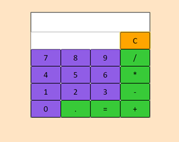

# Calculadora ➕➖✖️➗
 

Calculadora simples feita em JavaScript.

 

Link para o site: https://gabimesquita.github.io/Calculadora/

 
 
 
<h2>Como usar?</h2>

1. Clique nos operadores que deseja calcular (ex.: 8+2, 7*5).

2. Clique no sinal de = (igual) para ver o resultado.

3. Para limpar a tela do resultado, clique em C.
 

<h2>Licença</h2>

MIT (Massachusetts Institute of Technology)

